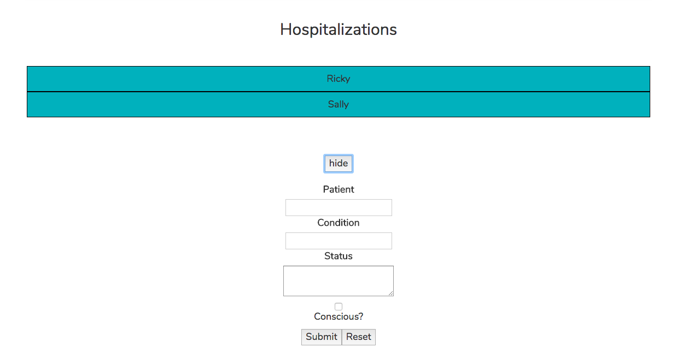
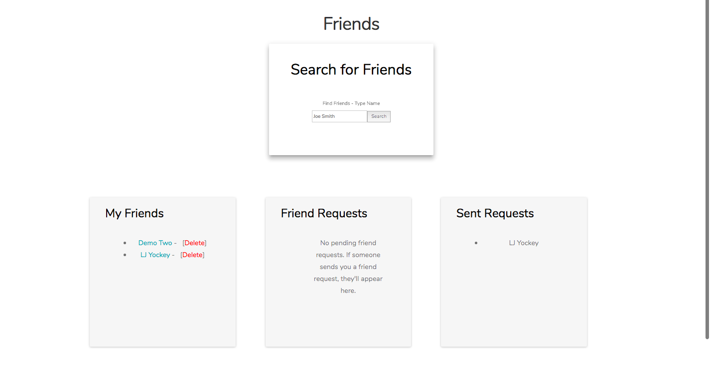

<h1>HospitAlert</h1>
<p><a href="http://hospitalert.com">HospitAlert</a> is a responsive full-stack app that allows users to keep their family up-to-date when a loved one is hospitalized.</p>
<br>

## Getting started
### Installing
```
>   git clone https://github.com/Ljyockey/hospitalert-client.git
>   cd hospitalert-client
>   change DATABASE_URL to https://hospitalert-api.herokuapp.com in config.js
>   npm install
```
### Launching
```
>   npm start
```
Then open [`localhost:3000`](http://localhost:8080) in a browser.

<h2>Introduction</h2>
<p>The main focus of HospitAlert is to keep family up-to-date when a loved one is hospitalized if they are unable to make it to the hospital themselves.</p>

<h2>How it Works</h2>
<h3>Add an event (hospitalization)</h3>

<p>Add an event when a loved one is hospitalized. Basic information can be added like the patient's name, their condition (reason for being in the hospital), whether or not they're conscious, and the latest update from the doctor.</p>
<h3>Add Friends</h3>

<p>Add friends you know and trust. They will be able to see updates you've made to your hospitalizations</p>

<h2>Technology</h2>
<h3>Front End</h3>
<ul>
  <li><a href="https://github.com/facebookincubator/create-react-app">Create React App</a></li>
  <li><a href="http://getbootstrap.com/getting-started/">Bootstrap</a></li>
  <li><a href="https://getmdl.io/index.html">Material Design</a></li>
</ul>
<h3>Back End</h3>
<p>The database and API for this app can be found <a href="https://github.com/Ljyockey/hospitalert-api">here</a>.

<h3>Continuous Integration</h3>
<ul>
<li>Jest</li>
<li>Enzyme</li>
<li>Travis CI</li>
</ul>

<h3>Responsive</h3>
<ul>
  <li>The app is fully responsive and quickly adapts to all mobile, tablet, and desktop viewports.</li>
</ul>

<h2>Upcoming Improvements</h2>
<p>Since launching the <a href="https://github.com/Ljyockey/hospitalert">V1 Demo</a>, the following changes have been made:</p>
<ul>
	<li>User accounts</li>
	<li>The ability to login through Facebook</li>
	<li>SQL instead of MongoDB</li>
	<li>React</li>
</ul>
<p>Soon, users who are unable or unwilling to create an account with Facebook will be able to create an account with their email address.</p>